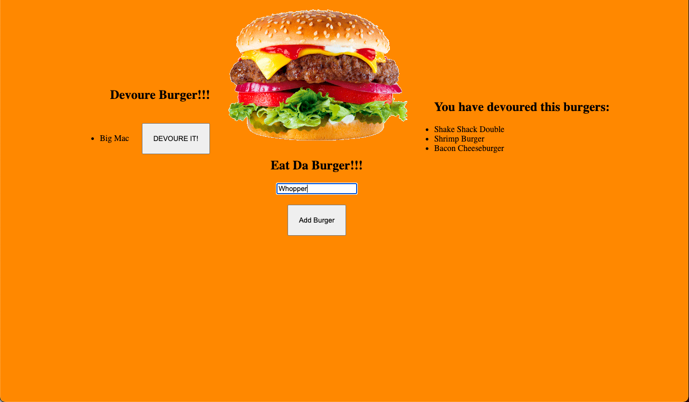

# burger

## Description

An application that uses MYSQL, Node, Express, Handlebars, and ORM to store and display burgers that customers want to eat and then show when they devour them.

## User Story 
A user wants to log all the burgers they have eaten and show which ones were devoured

## Installation

`npm init -y`

`npm i mysql express express-handlebars`

## Usage

`node server`

## Contributing
[Justin Hohing](https://github.com/jhohing)

## Questions
Contact me with any questions: [email](mailto:jnh0627@yahoo.com) , [GitHub](https://github.com/jhohing) 